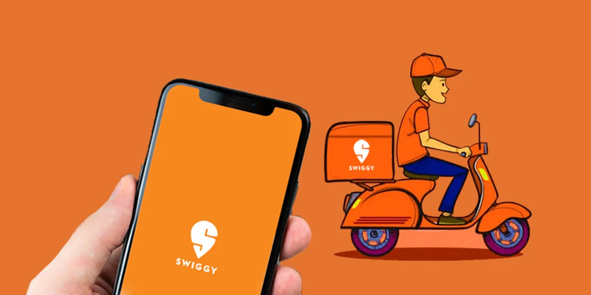

# Swiggy_Performance_Analysis

&nbsp;

## Overview

This Power BI dashboard provides comprehensive insights into the sales performance of Swiggy. It visualizes data related to revenue, orders, cancellations, and customer trends, enabling data-driven decisions. The dashboard includes interactive visuals and filters for an enhanced user experience.

## Tool used :
&nbsp;

## Key Metrics

- Revenue: ₹367B

- Total Orders: 15K

- Successful Orders: 90.14% (13.52K)

- Cancellation Rate: 9.86%

## Features

- Revenue by Restaurant: Displays earnings from top-performing restaurants like Biryani House, Pav Bhaji Hub, and Chaat Bazaar.

- Orders by Day: Analyzes total orders distribution across weekdays and weekends.

- Top Customers: Lists highest order contributors and their total orders.

- Most Ordered Dishes: Highlights demand for top dishes like Chole Bhature, Dosa, and Pav Bhaji.

- Revenue Trend: Tracks monthly revenue fluctuations.

- Order Success Rate: Displays successful vs. canceled orders.

## Usage

1️⃣ Open the Power BI file (.pbix) in Power BI Desktop.

2️⃣ Connect to your data source if required.

3️⃣ Interact with the dashboard to analyze sales and customer trends.

## Key Insights

✅ Revenue Performance – Total revenue stands at ₹367B, with a stable monthly trend.

✅ Order Trends – 15K total orders, with a 90.14% success rate and a 9.86% cancellation rate.

✅ Top-Selling Restaurants – Biryani House, Pav Bhaji Hub, and Chaat Bazaar generate the highest revenue.

✅ Most Ordered Dishes – Chole Bhature (4.7K orders), Dosa, Pav Bhaji, Paneer Tikka, and Samosa dominate customer preference.

✅ Customer Behavior – Orders are evenly distributed across all days (~2.1K daily), with no clear peak days.

## Recommendations

✅ Boost Revenue & Sales

- Promote top-selling dishes (Chole Bhature, Dosa) with combos & discounts.

- Expand top-performing restaurants (Biryani House, Pav Bhaji Hub) via cloud kitchens.

✅ Reduce Order Cancellations

- Improve real-time tracking & stock updates to prevent cancellations.

- Offer compensation (discounts/coupons) for affected customers.

✅ Enhance Customer Engagement

- Reward top customers with exclusive perks & cashback.

- Encourage ratings & reviews through loyalty points.

✅ Optimize Marketing Strategies

- Run geo-targeted ads in low-order cities.

- Introduce happy-hour & weekend deals for peak-hour sales.

## Dashboard :
&nbsp;
